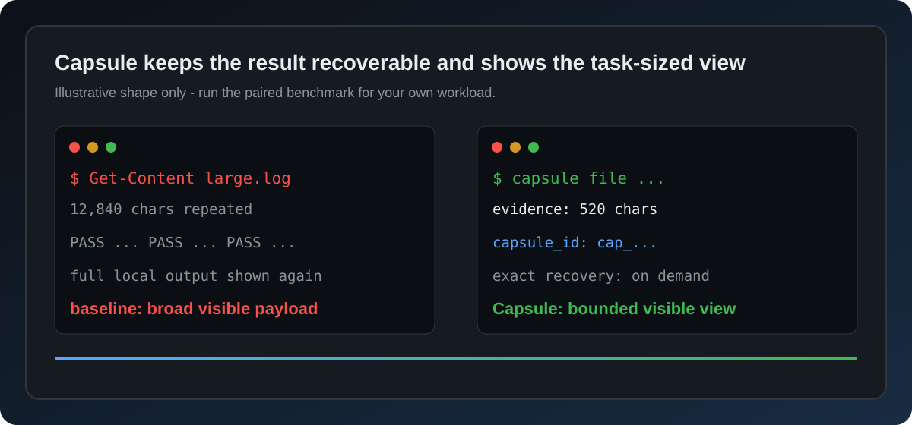

# Capsule — Codex plugin MCP server for exact-recoverable token efficiency

[](https://github.com/hakiyaka/capsule/actions/workflows/ci.yml)
[](LICENSE)
[](https://hakiyaka.github.io/capsule/)
[](https://github.com/hakiyaka/capsule/releases)
[](https://github.com/hakiyaka/capsule/discussions)
[](https://github.com/hakiyaka/capsule)

> **A local-first Codex plugin and MCP server for exact-recoverable context compression.**
>
> Capsule reduces model-visible terminal, file, project, web, and context
> output while keeping the complete result locally recoverable.

Capsule is a Codex token efficiency tool and an MCP context compression layer:
it keeps the smallest safe evidence view visible while preserving exact local
recovery for the complete result.



The graphic is illustrative, not a universal percentage claim; reproduce the
paired workload with the benchmark commands below.

Codex does not need to reread the same terminal output, whole files, project
neighbours, web pages, or tool catalogues on every turn. Capsule turns that
repetition into compact, exact-recoverable evidence.

## Why Capsule?

| Without Capsule | With Capsule |
| --- | --- |
| Repeated output fills the context window | Replays become a compact exact handle |
| Large files are reread from line 1 | Task-specific ranges are selected first |
| A project is explored file by file | Symbols and dependency impact are compiled once |
| Web results arrive as a giant page | Text, URLs, and reference IDs stay recoverable on demand |
| Every tool exposes its full catalogue | Common actions stay small; the rest is discoverable |

The core rule is simple:

`request -> classify -> compact view
                    \-> exact local evidence -> expand on demand`

Capsule is local-first, deterministic, and conservative. If a projection would
be larger, lossy, unsafe, or explicitly disallowed, it passes the original
result through.

## What it covers

- **Terminal:** `run`, `batch`, and `flow` projections remove repeated,
  low-value stdout/stderr while preserving failures and critical lines.
  Plain PowerShell `Get-Content` reads use a verified local file fast path,
  query-focused evidence, and unchanged-file replay; unsafe or complex syntax
  falls back to the normal shell. See the [Get-Content guide](https://hakiyaka.github.io/capsule/guide/get-content-token-savings.html).
- **Files:** bounded reads, replay detection, immutable-baseline edits, and
  exact range expansion.
- **Projects:** incremental symbol/dependency indexing, impact cones, and
  proof packets for query and refactor work.
- **Web:** bounded structured results plus an opt-in, lossless web lease for
  exact text, URLs, and `ref_id` recovery. See the [web search guide](https://hakiyaka.github.io/capsule/guide/web-search-token-savings.html).
- **Context:** compaction ledgers, memory loadouts, polling receipts, and
  pressure-aware summaries.
- **Skills and tools:** abstaining skill routing, deferred action discovery,
  local filters, and batched execution.
- **Measurement:** workload-specific A/B benchmarks and local gain telemetry;
  start with the [benchmark methodology](https://hakiyaka.github.io/capsule/guide/benchmarks-and-methodology.html).
- **Release quality:** shared atomic state primitives, portable verification,
  and a documentation/link audit for public installations.

Capsule does not claim to control hidden provider-side reasoning, cache, or
billing counters. Its measurements describe the observable model-facing
payload and local exact-recovery path.

## Find Capsule

Capsule is an open-source **Codex token-efficiency**, **MCP context-compression**,
and **AI-agent developer-tool** project. The public project site is
[hakiyaka.github.io/capsule](https://hakiyaka.github.io/capsule/); the source,
benchmarks, installation instructions, and release history remain on GitHub.
Use the site for a concise overview and the repository for exact implementation
and verification evidence.

In search terms, Capsule is a **codex-plugin MCP server** for **token reduction**
and **exact-recoverable context**; each phrase describes a shipped capability,
not a ranking promise.

Questions and workflow comparisons belong in the public
[Discussions](https://github.com/hakiyaka/capsule/discussions); reproducible
defects belong in [Issues](https://github.com/hakiyaka/capsule/issues).
The recommended starting point is [How to measure Capsule visibility and
token-efficiency results](https://github.com/hakiyaka/capsule/discussions/1).
For concise boundary and compatibility answers, see the [Capsule FAQ](https://hakiyaka.github.io/capsule/guide/faq.html).

Public guides: [install](https://hakiyaka.github.io/capsule/guide/install-capsule.html),
[Codex token efficiency](https://hakiyaka.github.io/capsule/guide/codex-token-efficiency.html),
[MCP context compression](https://hakiyaka.github.io/capsule/guide/mcp-context-compression.html),
[Get-Content](https://hakiyaka.github.io/capsule/guide/get-content-token-savings.html),
[web search](https://hakiyaka.github.io/capsule/guide/web-search-token-savings.html),
[terminal output](https://hakiyaka.github.io/capsule/guide/terminal-output-token-savings.html),
[benchmarks](https://hakiyaka.github.io/capsule/guide/benchmarks-and-methodology.html),
[share and cite](https://hakiyaka.github.io/capsule/guide/share-and-cite.html), and
[GitHub discoverability](https://hakiyaka.github.io/capsule/guide/github-discoverability.html).

## A measured first web call

For a first real web search (local measurement):

| | Size |
| --- | ---: |
| Raw result | 25,877 characters |
| Capsule lease | 519 characters |
| Model-facing reduction | **97.99%** |
| Recovery | **byte-exact** |

This is one workload, not a universal percentage. Run the benchmarks on your
own tasks before drawing billing conclusions.

## Install

### Requirements

- Node.js 18 or newer
- Codex with local plugin/MCP support
- Windows, macOS, or Linux
- Python 3 only for the optional Python benchmarks

### Local plugin

```sh
git clone https://github.com/hakiyaka/capsule.git
cd capsule
npm test
```

Add the repository root as a local Codex plugin. The bundled
`.codex-plugin/plugin.json` and `.mcp.json` register the `capsule` MCP server
and its lifecycle hooks. Trust the hooks when Codex asks, then restart Codex.

For a reproducible checkout instead of the moving `main` branch, use the
[v1.0.2 release](https://github.com/hakiyaka/capsule/releases/tag/v1.0.2) and
verify its [SHA-256 sidecar](https://github.com/hakiyaka/capsule/releases/download/v1.0.2/capsule-1.0.2-source.zip.sha256)
before unpacking the source archive. Capsule is intentionally clone/release
based (`package.json` remains private); it is not the unrelated public npm
package named `capsule`.

Verify that the server is loaded:

```json
{"action":"doctor","payload":{}}
```

For a deliberate global-hook installation or removal:

```sh
npm run hooks:install
npm run hooks:status
npm run hooks:restore
```

## The action surface

| Goal | Capsule action |
| --- | --- |
| Plan a bounded task | `advisor` |
| Route an installed skill | `skills` |
| Run commands | `run`, `batch`, `flow` |
| Read or edit a file | `file` |
| Understand a codebase | `project` |
| Index or recall durable facts | `index`, `search`, `remember`, `memory` |
| Fetch a real URL | `fetch` |
| Derive structured data | `execute` |
| Recover exact evidence | `expand`, `diff` |
| Measure behavior | `stats`, `gain`, `insight`, `doctor` |

Examples:

```json
{"action":"run","payload":{"command":"npm test"}}
{"action":"project","payload":{"operation":"query","root":"."}}
{"action":"memory","payload":{"operation":"recall","query":"current task","max_chars":900}}
```

For large memory stores, use progressive disclosure: `index` returns compact
IDs and previews; `get` recovers one selected record exactly.

For multi-project or multi-agent stores, add a deterministic `loadout` (or
`binding`) to pre-filter the candidate set before ranking. It accepts `tags`,
`sources`, `layers`/`asset_types`, and `scope`; `strict_scope:true` prevents
unscoped records from crossing a project or team boundary. This is local
selection, not a replacement for a provider or server-side ACL. Set
`strategy:"bootstrap"` to prefer L3/L2 profile and scenario records first,
falling back to L1/L0 only when no high-level match exists.

```json
{"action":"memory","payload":{"operation":"index","query":"current task","max_chars":420}}
{"action":"memory","payload":{"operation":"get","id":"mem_..."}}
{"action":"memory","payload":{"operation":"recall","query":"release check","loadout":{"tags":["release"],"scope":{"project":"demo"},"strict_scope":true,"strategy":"bootstrap"},"max_chars":900}}
```

`fetch` requires a real `payload.url` or `payload.requests`.
`expand` and `diff` require a real `payload.capsule_id` returned by an earlier
Capsule call. Capsule never invents recovery IDs.

## Lossless web mode

Web zero-copy is intentionally opt-in because it replaces the visible response
with a local lease. The complete response remains on disk, addressed by its
SHA-256 hash; no text, URL, or reference ID is discarded.

```powershell
$env:CAPSULE_WEB_ZERO_COPY="1"
```

Or enable one call with `capsule_web_zero_copy: true`. Measure it with:

```sh
npm run benchmark:web:zero-copy
```

The same exact-recovery principle is available for media with:

```sh
npm run benchmark:media:zero-copy
```

## Safety contract

Capsule follows four rules:

1. **Exact first:** the original result is stored before a compact view is
   emitted.
2. **No token-negative compression:** small, literal, failed-to-classify,
   `raw`, `full`, `exact`, `benchmark`, or `verbatim` requests pass through.
3. **Proof on demand:** every compact view identifies how to recover the
   complete evidence.
4. **Local and bounded:** state is local, caches have finite limits, and
   fingerprints are preferred over raw prompts.

For web and media leases, the exact file is content-addressed and verified
with SHA-256. For file edits, stale or overlapping baselines reject the whole
transaction before writing.

## Benchmarks and verification

Run the fast confidence set:

```sh
npm run verify
npm run benchmark:web:zero-copy
npm run benchmark:project
npm run benchmark:refactor
npm run benchmark:get-content
npm run benchmark:get-content:history
```

`npm run verify` runs the complete Node test suite, source-integrity audit,
public-readiness audit, and documentation audit. Run the broader suites with
`npm run benchmark:full`. All benchmark results
are workload-specific; they are not a promise of a fixed saving on every
prompt or a substitute for provider billing telemetry.

For the GitHub visibility goal, run the read-only authenticated snapshot:

```sh
npm run audit:github-visibility
```

It reports stars, forks, releases, the exact topic names, repository surface
flags, community health, Pages status, and the rolling 14-day views/clones
window. It also records the observed start/end timestamps, sample-point count,
and API lag for the views and clones arrays so a stale rolling window is not
mistaken for a current trend. If the authenticated traffic endpoints are not
available, the report records `*_available:false` and the bounded API error
instead of inventing zero traffic. Referrer uniques are explicitly a sum of
GitHub's per-domain values, not a global unique-user count. Pass
`--baseline path/to/snapshot.json` to compute
ratios against a prior snapshot, or add `--write path/to/snapshot.json` to
save the read-only report for the next comparison. It also records aggregate
referrer and popular-path counts so future outreach can be tied to observed
traffic; traffic data is not written to Capsule state. Referrers come from
GitHub's `traffic/popular/referrers` endpoint. If that endpoint is unavailable,
the audit records an empty list and does not infer that traffic was zero.
For a fork or another public repository, set `CAPSULE_GITHUB_REPO=owner/name`
or invoke `node scripts/github-visibility-audit.cjs --repo owner/name`;
otherwise the documented default is `hakiyaka/capsule`. Do not rely on
`npm run ... -- --repo` option forwarding on Windows.

On Windows, where npm can consume leading option names, the explicit helpers
are reliable:

```sh
npm run audit:github-visibility:write -- path/to/snapshot.json
npm run audit:github-visibility:baseline -- path/to/snapshot.json
npm run audit:github-visibility:search
npm run audit:github-visibility:search:write -- path/to/search.json
npm run audit:github-visibility:search:baseline -- path/to/search.json
```

The search helper records the first 100 GitHub repository-search results for
five fixed, relevant queries. Search order is volatile and is reported as a
snapshot only; it is not a promise about Google ranking or traffic. When a
search-enabled snapshot is compared with `--baseline`, the report also emits
null-safe per-query rank, first-100 presence, and result-count deltas.

For a consistent public reference, use the [share and cite guide](https://hakiyaka.github.io/capsule/guide/share-and-cite.html),
the canonical [GitHub repository](https://github.com/hakiyaka/capsule), or
[CITATION.cff](CITATION.cff). Describe the workload and version beside any
measurement; do not present one benchmark as a universal saving or ranking claim.

The historical Get-Content replay benchmark is bounded by
`CAPSULE_HISTORY_MAX_BYTES` (2 GB by default) and reports only aggregate,
hash-safe measurements; it does not export session text.

See [BENCHMARK.md](BENCHMARK.md) for methodology and [CHANGELOG.md](CHANGELOG.md)
for release history. The 100-project research ledger is in
[GITHUB-100-RESEARCH.md](GITHUB-100-RESEARCH.md).

## Search visibility and publishing

The `docs/` site is a small, crawlable GitHub Pages landing page with a
canonical URL, `robots.txt`, XML sitemap, Open Graph metadata, and JSON-LD.
The Pages deployment is defined in
[`.github/workflows/pages.yml`](.github/workflows/pages.yml). After enabling
Pages for the repository, add `https://hakiyaka.github.io/capsule/` as a
verified property in Google Search Console and submit
`https://hakiyaka.github.io/capsule/sitemap.xml`; Google controls crawl and
ranking decisions, so submission is a discovery signal rather than a ranking
guarantee.
The same owner-controlled verification and sitemap submission can be done in
Bing Webmaster Tools; no verification token is included here because tokens
must belong to the repository owner.
GitHub's repository-level link card is separate from Pages metadata: upload
[`docs/social-card.png`](docs/social-card.png) under **Settings → General →
Social preview** when you control the repository, then verify it with
`gh repo view --json usesCustomOpenGraphImage,openGraphImageUrl`.
The same site exposes a small [RSS feed](https://hakiyaka.github.io/capsule/feed.xml)
for release and all ten guide pages so real users and aggregators can follow
changes without relying on a search result.
The [GitHub discoverability guide](https://hakiyaka.github.io/capsule/guide/github-discoverability.html)
documents the repeatable metadata, traffic, referral, release, and repository-search audit.
An intentionally concise [machine-readable summary](https://hakiyaka.github.io/capsule/llms.txt)
keeps the canonical links and measurement caveat available to indexing tools.
The repository also has a weekly and manually dispatchable read-only visibility
workflow; it stores timestamped JSON snapshots as short-lived Actions artifacts,
never comments, stars, forks, or edits the repository. Semver tags trigger the
release workflow, which rebuilds the source archive and checksum from the exact
tag before publishing them.
Run `npm run audit:live` after a Pages deployment to verify the public HTML,
FAQ metadata, PNG social card, sitemap, robots directive, RSS item, and
machine-readable links over HTTPS. It is a smoke test, not proof of ranking.

## Repository map

```text
capsule/
|-- mcp/             MCP server and core actions
|   `-- storage.cjs   shared atomic JSON, bounds, and hashing primitives
|-- scripts/         lifecycle hook, installers, and audits
|-- hooks/           bundled Codex hook entry points
|-- bench/           reproducible A/B benchmarks
|-- tests/           contract and parity tests
|-- skills/          optional skill packages
|-- docs/            crawlable Pages site and search-intent guides
`-- .codex-plugin/  Codex plugin manifest
```

## Privacy

Automatic decisions store bounded counters and keyed fingerprints, not raw
prompts. Explicit `index`, `remember`, and `memory capture` operations store
only the content requested by the caller. State lives in the platform-appropriate
local data directory.

Set `CAPSULE_STATE` to an absolute directory to choose a different local state
root. Use the supported `purge` operation to remove cached projects or
capsules.

## Contributing

Read [CONTRIBUTING.md](CONTRIBUTING.md) before opening a pull request. Report
security issues using [SECURITY.md](SECURITY.md). Capsule is released under
the [MIT License](LICENSE).
